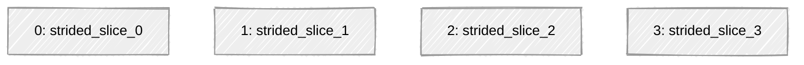

# aot-unit-test AOT Inference Module

> 🔧 **Generated by HeliosAOT** on 2025-06-03

## ⚡️ Overview

This folder contains an ahead-of-time (AOT) compiled C inference module for **aot-unit-test**, targeting **neuralspot**.
It implements your LiteRT model **strided_slice_stress_int8.tflite**.

- [Model Contents](#module-contents)
- [Model Summary](#model-summary)
- [Configuration](#configuration)
- [Integration / Build](#integration--build)
- [Usage Example](#usage-example)
- [License](#license)
- [Model Diagram](#model-diagram)

## 📦 Module Contents

```console
aot-unit-test
├── LICENSE.txt ← license for this module
├── README.md ← this file
├── includes-api/ ← API header files
├── src/ ← C source files
├── zephyr/ ← For Zephyr integration
├── module.mk ← For neuralSPOT integration
└── CMakeLists.txt ← For Zephyr integration
```

## 🧠 Model Summary

| Property               | Value                         |
|------------------------|-------------------------------|
| **Model name**         | strided_slice_stress_int8.tflite                 |
| **Model Version**      | v1.0.0              |
| **Subgraph Index**     | 0                   |
| **Operator Count**     | 4            |
| **Unique Ops**         | 1           |
| **Input Shape**        | (  1, 8, 8, 3)        |
| **Output Shape**       | (  1, 3, 3, 3)       |

## ⚙️ Operators Used

| Operator           | Count |
|--------------------|-------|
| `STRIDED_SLICE` | 4 |

## 🎛️ Configuration Parameters

```yaml
model_path: /Users/adampage/Downloads/helios-aot-tflites/strided_slice_stress_int8.tflite
output_path: /Users/adampage/Ambiq/research/mve-kernel-exp/modules
module_name: aot-unit-test
module_type: neuralspot
prefix: aot
memory_planner: greedy
operator_attributes: []
transforms:
  transforms:
    PruneReshapeOps: true
    PruneSqueezeOps: true
include_test: true
test_tolerance: 1.0
subgraph: 0
model_version: v1.0.0
verbose: 2
log_file: null

```

## 🛠️ Integration / Build

### Zephyr RTOS

1. Copy this module into your Zephyr project under modules/lib/aot-unit-test.

2. Add to your west.yml:

    ```yaml

    projects:
    - name: aot-unit-test
        path: modules/lib/aot-unit-test
        revision: main   # or pin a tag/commit
    ```

3. In your application’s CMakeLists.txt:

    ```cmake
    find_package(aot-unit-test REQUIRED)
    target_link_libraries(app PRIVATE aot-unit-test::aot-unit-test)
    ```

4. Build with:

    ```bash
    west build -b <board> samples/your_app
    ```

### neuralSPOT

🚧 Coming soon...

## 🚀 Usage Example

```c

#include "aot_model.h"

// Define input/output buffer
int8_t input[aot_input_len] = { 0 };
int8_t output[aot_output_len];

// Define model context and callback
static void aot_model_operator_cb(
    int32_t op,
    aot_operator_state_e state,
    int32_t status,
    void *user_data
) {
    switch (state) {
        case aot_model_state_started:
            ns_lp_printf("Operation %d started\n", op);
            break;
        case aot_model_state_finished:
            ns_lp_printf("Operation %d finished with status %d\n", op, status);
            break;
    }
}


// This is optional, but useful for profiling or debugging
aot_model_context_t aot_model_ctx = {
    .callback = aot_model_operator_cb,
    .user_data = NULL
};

int main(void) {
    // Initialize model
    int32_t status;
    status = aot_model_init(&aot_model_ctx);

    // Run inference
    status = aot_model_run(&aot_model_ctx, input, output);

    return 0;
}

```

## License

This code is licensed under the terms in [LICENSE.txt](./LICENSE.txt).
Use of this generated module is restricted to Ambiq hardware only.

---

## Model Diagram


